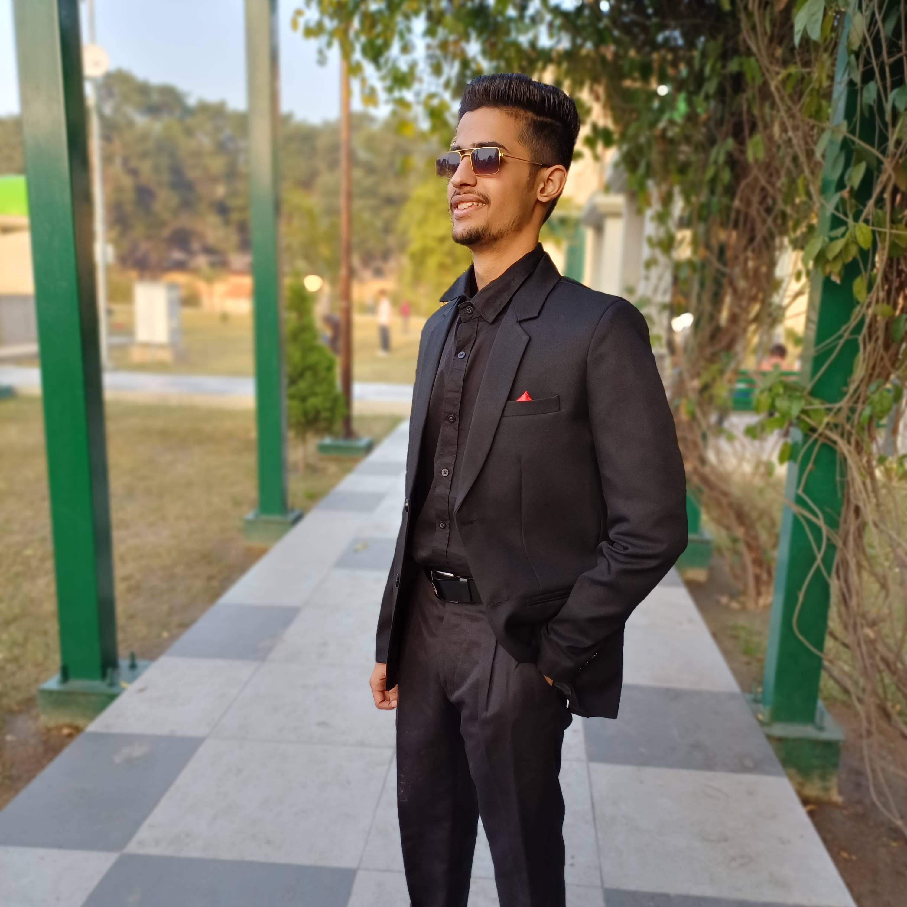

# vabhav.github.io
***VABHAV BHATEJA***

# Welcome to My portfolio

## *INTRODUCTION*
Greetings, I am Vabhav Bhateja, a passionate B.Tech Computer Science and Engineering student with the passion of learning new programming languages and exploring the tech field.

## *TECHINCAL SKILL*
programming language: learing python

## POWER SKILL
quick learner
inquisitively solves problems
values imagination and innovation

## education
secondary education :Atam devki niketan,ludhiana,punjab (percentage: 90.4%)
 
higher secondary education: Atam devki niketan,ludhiana (percentage: 90.4)

## Contact Me
You can reach out to me at 13vabhav@gmail.com
 
You can reach out to me at 8427576917
